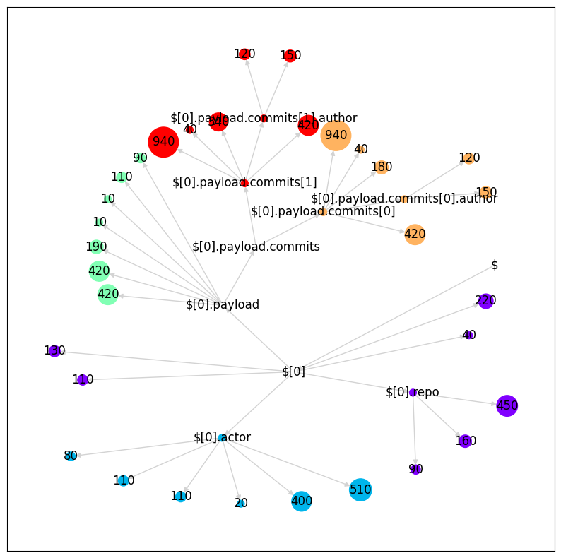
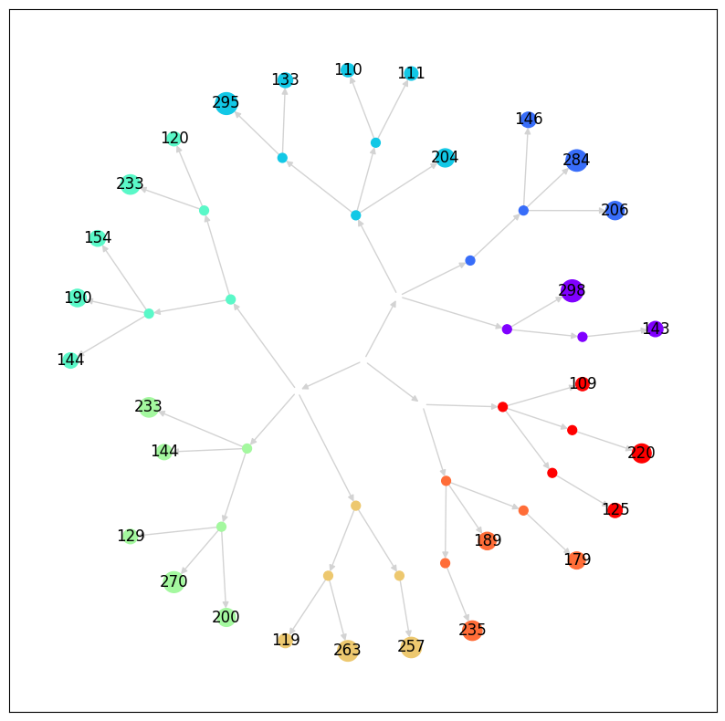

# JSON Document Splitter
This repo splits JSON documents into even chunks.

## Usage
```python
import json
from json_document_splitter import JSONDocumentSplitter
from transformers import AutoTokenizer

tokenizer = AutoTokenizer.from_pretrained('gpt5')
splitter = JSONDocumentSplitter(JSONDocumentSplitter.Options(
  tokenizer=tokenizer,
  max_length=1024,
  dumps=lambda chunk: json.dumps(chunk.value),
))
```

## Examples

### Github Commit Data
See used JSON data [here](./examples/github-commit/data.json)

```python
import json
from typing import Dict
from json_document_splitter import create_graph, sample_clusters, visualize

with open('./examples/github-commit/data.json') as f:
  data = json.load(f)

graph = create_graph(data, calculate_weight=lambda x: len(str(x)) * 10)
clusters = sample_clusters(graph, max_weight=1000, include_child_nodes=True)
visualize(graph, clusters)
```



#### Chunks
```json
Path:  $/0
Value:  {
  "id": "32683206386",
  "type": "PushEvent",
  "public": true,
  "created_at": "2023-10-19T08:24:41Z",
  "repo": {
    "id": 643404382,
    "name": "davidfant/topt",
    "url": "https://api.github.com/repos/davidfant/topt"
  }
}

Path:  $/0
Value:  {
  "created_at": "2023-10-19T08:24:41Z",
  "actor": {
    "id": 17096641,
    "login": "davidfant",
    "display_login": "davidfant",
    "gravatar_id": "",
    "url": "https://api.github.com/users/davidfant",
    "avatar_url": "https://avatars.githubusercontent.com/u/17096641?"
  }
}

Path:  $/0/payload
Value:  {
  "repository_id": 643404382,
  "push_id": 15480889582,
  "size": 2,
  "distinct_size": 2,
  "ref": "refs/heads/master",
  "head": "3cc2405dc3352b4eb058bdb9fcd6a4048bd22457",
  "before": "0ed5c2cc7047177f67241b93ffd568d6405e447f"
}

Path:  $/0/payload/commits/0
Value:  {
  "sha": "5e599ae5c5daee8e88460ede2a55b3990ac1f9c1",
  "author": {
    "email": "david@fant.io",
    "name": "David Fant"
  },
  "message": "fixed unit tests",
  "distinct": true,
  "url": "https://api.github.com/repos/davidfant/topt/commits/5e599ae5c5daee8e88460ede2a55b3990ac1f9c1"
}

Path:  $/0/payload/commits/1
Value:  {
  "sha": "3cc2405dc3352b4eb058bdb9fcd6a4048bd22457",
  "author": {
    "email": "david@fant.io",
    "name": "David Fant"
  },
  "message": "formats dict key and value types",
  "distinct": true,
  "url": "https://api.github.com/repos/davidfant/topt/commits/3cc2405dc3352b4eb058bdb9fcd6a4048bd22457"
}
```


### Random Document
```python
import random
from typing import Dict
from json_document_splitter import visualize, create_graph, sample_clusters, ClusterCandidate

def create_random_dict():
  max_children = 3
  max_depth = 4
  min_weight = 100
  max_weight = 300

  def recurse(value: Dict, depth: int = 0):
    if depth >= max_depth:
      return random.randint(min_weight, max_weight)
    else:
      num_children = random.randint(max_children - depth, max_children)
      return { i: recurse({}, depth + 1) for i in range(num_children) } 

  return recurse({})

def calculate_weight(candidate: ClusterCandidate) -> int:
  def sum_of_leaf_values(value: Any):
    if isinstance(value, list):
      return sum(sum_of_leaf_values(v) for v in value)
    elif isinstance(value, dict):
      return sum(sum_of_leaf_values(v) for v in value.values())
    return int(value)
  return sum_of_leaf_values(candidate.value)

random_dict = create_random_dict()
graph = create_graph(random_dict)
clusters = sample_clusters(graph, max_weight=1000, calculate_weight=calculate_weight)
visualize(graph, clusters, calculate_weight=calculate_weight, label_objects_and_arrays=False)
```




## Development

### Unit Tests
```bash
python3 -m unittest discover
```

### Linting
```bash
python3 -m pyright
```
